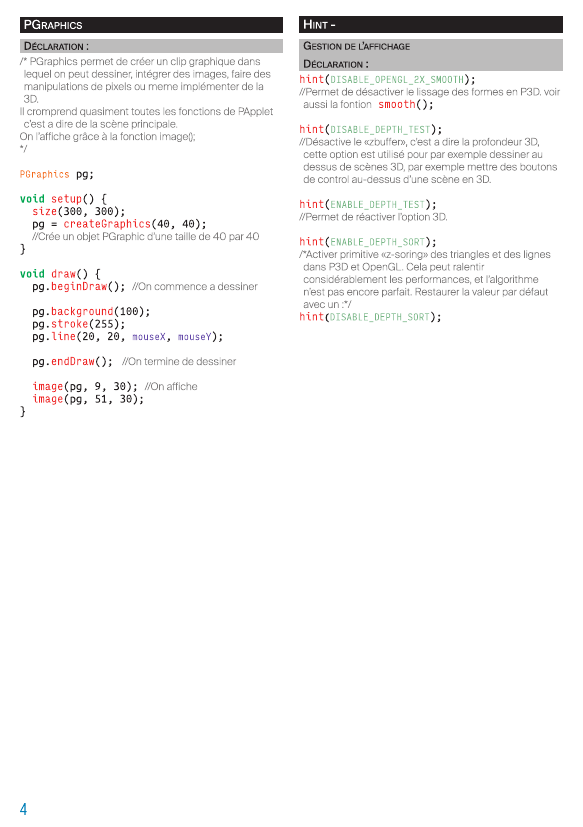

# Mémo Processing

Mémo Processing (non exhaustif) à l'usage des Graphistes/Artistes/Designers/Ingénieurs  

Voici un lien ou vous pouvez le télécharger :  
[Télécharger memoProV2_6](memoProV2_6.pdf)  
(non-imposé)  
  
[Télécharger memoPro_imp](memoPro_imp.pdf)  
(imposé par planche, imprimé les pages paires, retourner les pages et imprimez les pages impaires)

  
Vous pouvez ensuite l'imprimer par 2 pages recto/verso pour obtenir un livret au format A5.  
N'hésitez pas ajouter des _pulls requests_ si voux juger qu'il manques certaines choses.

---

	
	
	
	
	
	
	
	
	
	
	
	
	
	
	
	
	
	
	
	

---
